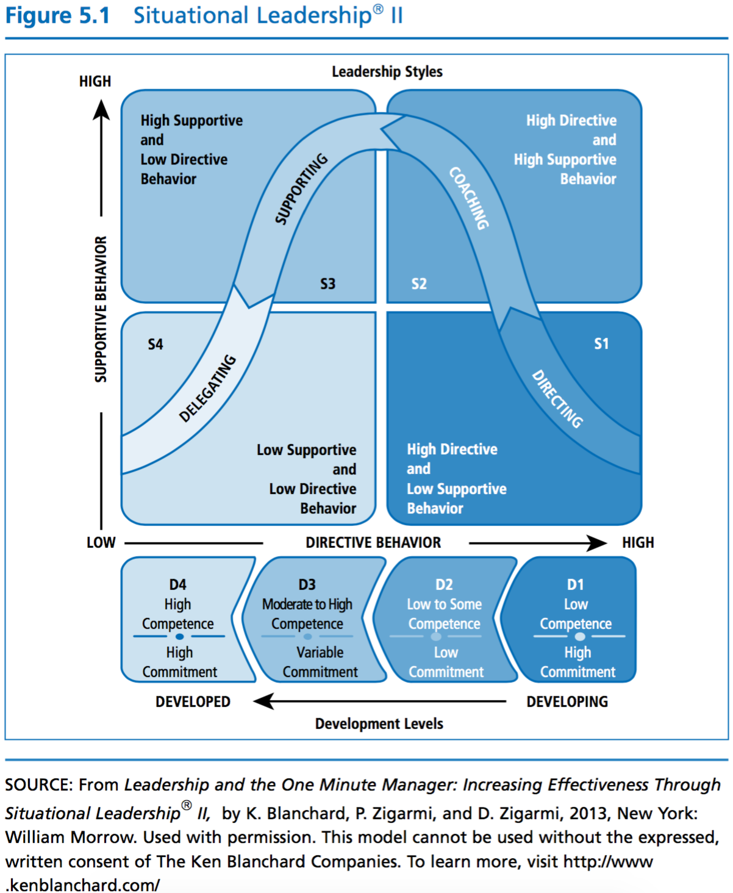

# Session 4

## Learning Objectives
Explain the “Style Approach” and its central purpose.
Evaluate individual orientation using the “Style Questionnaire."
Discuss “Situational Leadership.”
Identify the characteristics of “Directive” and “Supportive” behaviors.
Identify the four levels by which employee development can be classified.

## Discussion 1: Leadership & Motivation

Does a leader’s motivation for adapting his or her leadership style have any effect on followers?  In other words, would a leader with a high concern for task differ from a leader with a high concern for relationships? Explain your answer.

## Discussion 2: Situational Leadership

The fundamental framework of the Situational Leadership Theory is that there is no single "best" style of leadership. Effective leadership is task-relevant and that the most successful leaders are those that adapt their leadership style to the Maturity ("the capacity to set high but attainable goals, willingness and ability to take responsibility for the task, and relevant education and/or experience of an individual or a group for the task) of the individual or group they are attempting to lead/influence.

Use YOUTUBE to find two video clips that represent the framework of situation leadership. These video clips should represent a good example of situational leadership and an example of poor situational leadership. Please explain your answers.

Examples:
* Remember The Titans, "Attitude Reflects Leadership"
* The Great Santini, "Introducing The Great Santini"

## Discussion 3: Discussion: Leadership Style

Leadership style is the behavior and approach of providing direction, implementing plans, and motivating people. Although good leaders use all three styles, with one normally dominant, bad leaders tend to stick with one style. Why? Can leadership style or behavior be developed? Give some specific examples.

## Chapter 4: Behavioral Approach

* emphasizes the behavior of the leader, on what the leader does and how they act
* includes actions of leaders towards followers in various context

* Leadership can be decomposed into two general kind of behaviors:
    * *task behavior* facilitate goal accomplishment
    * *relationship behaviors* help followers feel comfortable with themselves, each other, and the situation

### Ohio State Studies

* Leadership behavior questionnaire
* responses clustered around two general types:
    * *initiating structure* - task behaviors
    * *consideration* - relationship behaviors
* leader provide structure for followers and they nurture them, these two behaviors are distinct and independent

### Michigan Studies

* identified two leadership behaviors
    * employee orientation - approach subordinates with a strong human relations emphasis
    * production orientation - stress technical and production aspects of a job
* initiatlly looked at these behaviors as opposite ends of the spectrum, but then as more research came out... saw them as independent

### Managerial Grid

* Authority - Compliance places heavy emphasis on task and job requirements
* Country-Club Management has low concern for task accomplishment and high concern for interpersonal relationships
* Improverished Management represents leader who is unconcerned with both task and interpersonal relationships
* Middle of the Road Managment describes leaders who are compromisers. short term thinkers
* Team Management places a strong emphasis on both task and interpersonal relationships
    * leader stimulates participation, acts determined, gets issues into the open, makes priorities clear, follows through, behaves open-mindedly, and enjoys working.

### How Does Behavior Approach Work

* Unlike many of the other approaches discussed in the book, the behavioral approach is not a refined theory that provides a neatly organized set of prescriptions for effective leadership behavior. Rather, the behavioral approach provides a framework for assessing leadership in a broad way, as behavior with a task and relationship dimension.
    * how to behave, how not to behave

### Strengths

* The behavioral approach broadened the scope of leadership research to include the behaviors of leaders and what they do in various situations

* a wide range of studies on leadership behavior validates and gives credibility to the basic tenets of the approach

* researchers of the behavioral approach have ascertained that a leader’s style consists primarily of two major types of behaviors: task and relationship. The significance of this idea is not to be understated. Whenever leadership occurs, the leader is acting out both task and relationship behaviors; the key to being an effective leader often rests on how the leader balances these two behaviors. Together they form the core of the leadership process.

* he behavioral approach is heuristic. It provides us with a broad conceptual map that is worthwhile to use in our attempts to understand the complexities of leadership

### Criticisms

* does not show how behavior is associated with performance outcomes

* no universal style of leadership that is effective in every situation

* the most effective leadership is high-high
    * so you have to do *EVERYTHING* well

## Chapter 5: Situational Approach

* focuses on leadership in situations.The premise of the theory is that different situations demand different kinds of leadership. From this perspective, to be an effec- tive leader requires that a person adapt his or her style to the demands of different situations

* situational approach demands that leaders match their style to the competence and commitment of the followers

* approach is comprised of two major dimensions:
    * Leadership Style
    * Development Level of Followers

### Leadership Style

Leadership style consists of the behavior pattern of a person who attempts to influence others.

#### Directive Behaviors

* help group memebers accomplish goals by giving directions, establishing goals and methods of evaluation, setting timelines, defining roles, and showing how the goals are to be achieved
* one-way communication
* how to do things

#### Supportive Behaviors

* help group members feel comfortable about themselves, their coworkers, and the situation
* two-way communication

#### Dimensions

##### Directing

> In this approach, the leader focuses communication on goal achievement, and spends a smaller amount of time using supportive behaviors. Using this style, a leader gives instructions about what and how goals are to be achieved by the followers and then supervises them carefully.

##### Coaching

> In this approach, the leader focuses communication on both achieving goals and meeting followers’ socioemotional needs. The coaching style requires that the leader involve himself or herself with follow- ers by giving encouragement and soliciting follower input. However, coach- ing is an extension of S1 in that it still requires that the leader make the final decision on the what and how of goal accomplishment.

##### Supporting

> In this approach, the leader does not focus exclu- sively on goals but uses supportive behaviors that bring out followers’ skills around the goal to be accomplished. The supportive style includes listening, praising, asking for input, and giving feedback. A leader using this style gives followers control of day-to-day decisions but remains available to facilitate problem solving. An S3 leader is quick to give recognition and social support to followers.

##### Delgating

> In this approach, the leader offers less goal input and social support, facilitating followers’ confidence and motivation in reference to the goal. The delegative leader lessens involvement in planning, control of details, and goal clarification. After the group agrees on what it is to do, this style lets followers take responsi- bility for getting the job done the way they see fit. A leader using S4 gives control to followers and refrains from intervening with unnecessary social support.

### Development Levels

* concerns the development level of the followers
* it indicates whether a person has mastered the skills to achieve a specific goal and whether a person has devel- oped a positive attitude regarding the goal

* ollowers are at a high development level if they are interested and confident in their work and know how to achieve the goal. Followers are at a developing level if they have little skill for the goal at hand but believe that they have the motiva- tion or confidence to get the job done.

### How does Situational Approach Work?

> The situational approach is constructed around the idea that followers move forward and backward along the developmental continuum, which represents the relative competence and commitment of followers. For lead- ers to be effective, it is essential that they determine where followers are on the developmental continuum and adapt their leadership styles so they directly match their style to that development level.

> In a given situation, the first task for a leader is to determine the nature of the situation. Questions such as the following must be addressed: What goal are followers being asked to achieve? How complex is the goal? Are the followers sufficiently skilled to accomplish the goal? Do they have the desire to complete the job once they start it?

* Having identified the correct development level, the second task for the leader is to adapt his or her style to the prescribed leadership style

### Strengths

* Useful, practical, and intuitive
* Emphasizes leader flexibility
* Reminds us to treat each follower differently based on the goal at hand

### Criticisms

* not a lot of research
* development level theory is dicey
* not practical to give every single follower exactly what they need in a one-on-one basis
* questions are leading
