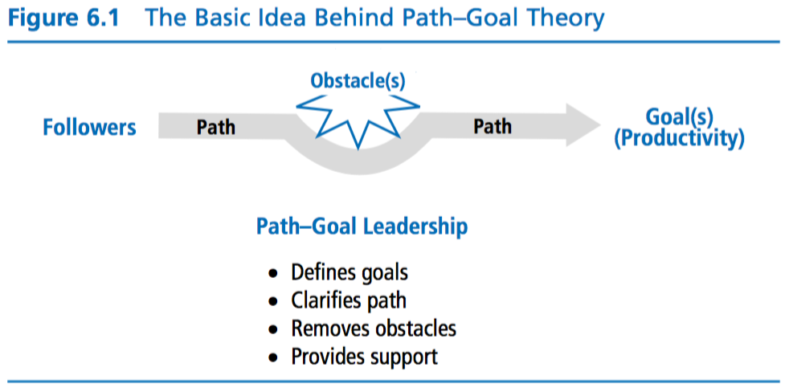
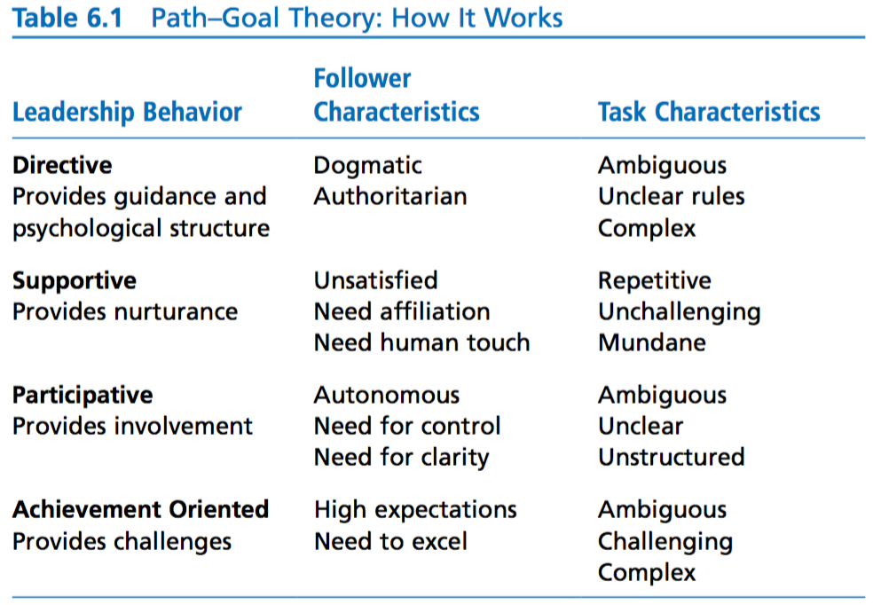
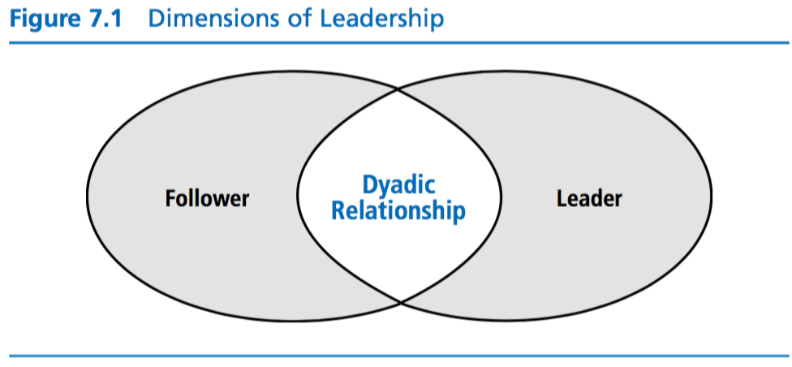

## Session 5

* Define “Contingency Theory.”
* Explain the three factors that need to be assessed when applying “Contingency Theory” to a situation.
* Analyze individual results on the Least Preferred Coworker (LPC) scale.
* Explain each of the four leader behaviors in “Path-Goal Theory."
* Identify the subordinate characteristics that influence how workers interpret a leader’s behavior.
* Identify the task characteristics that influence how workers interpret a leader’s behavior.
* Identify leadership style using Path-Goal Leadership Questionnaire.

## Discussion 1: Mars Rising - The Human Factor Ep. 4

What does the title mean to you? How does NASA define leadership? Explain your impression of this video.

## Discussion 2: Safeguarding Against Failure

According the path-goal theory of leadership, the leader has three major responsibilities: clarify the path so subordinates know which way to go, remove roadblocks that are stopping them from getting there, and increase the rewards along the route. This approach assumes that there is one right way of achieving a goal and that the leader can see it and the follower cannot. This approach can be extremely successful or dreadfully disastrous. What safe guards might an organization or leader take in order to safeguard against failures? Have you witnessed this approach to leadership? What was the result?

## Discussion 3: Discussion: The Contingency Theory

Explain how the contingency theory shifted the focus from static leadership traits, skills, and behaviors to a leader’s ability to evolve based on situational variables.

## Chapter 6: Path-Goal Theory

About how leaders motivate followers to accomplish designated goals

> The stated goal of this leadership theory is to enhance follower performance and follower satisfaction by focusing on follower motivation.

> In brief, path–goal theory is designed to explain how leaders can help fol- lowers along the path to their goals by selecting specific behaviors that are best suited to followers’ needs and to the situation in which followers are working. By choosing the appropriate style, leaders increase followers’ expec- tations for success and satisfaction.

### Expectancy Theory of Motivation

> The underlying assumption of expectancy theory is that followers will be motivated if they think they are capable of performing their work, if they believe their efforts will result in a certain outcome, and if they believe that the payoffs for doing their work are worthwhile.

* have to understand the goals of each follower and the rewards associated with the goals

### Major Components of Path-Goal Theory

#### Leader Behaviors

**Directive Leadership** - leader who gives followers instructions about their task included what is expected of them, how it is to be done, and the timeline for when it should be completed

**Supportive Leadership** - leader who is friendly and approachable as a leader and includes attending to the well-being and human needs of followers

**Participative Leadership** - inviting folowers to share in the decision making

**Achievement-Oriented Leadership** - leader who challenges followers to perform work at the highest level possible. High standards of excellence for followers and seeks continuous improvement

> Path–goal theory is not a trait approach that locks leaders into only one kind of leader- ship. Leaders should adapt their styles to the situation or to the motivational needs of their followers.

#### Follower Characteristics

* determine how a leader's behavior is interpreted by followers in a given work context

* **need for affiliation** -> supportive leadership
* **preferences for structure** -> directive leadership
* **desire for control**
    * internal locus of control (in charge of the events that occur in their lives) -> participative
    * external locus of control (outside forces determine life events) -> directive
* **self-perceived level of task ability** more confidence -> less directive leadership

#### Task Characteristics

> include the design of the follower’s task, the formal authority system of the organization, and the primary work group of followers

> When a situation provides a clearly structured task, strong group norms, and an established authority system, followers will find the paths to desired goals apparent and will not need a leader to clarify goals or coach them in how to reach these goals. Followers will feel as if they can accomplish their work and that their work is of value. Leadership in these types of contexts could be seen as unnecessary, unempathic, and excessively controlling.

* unclear tasks may call for leadership involvement

* Obstacles could be just about anything in the work setting that gets in the way of followers

> In 1996, House published a reformulated path–goal theory that extends his original work to include eight classes of leadership behaviors. Besides the four leadership behaviors discussed previously in this chapter—(a) directive, (b) supportive, (c) participative, and (d) achievement-oriented behavior—the new theory adds (e) work facilitation, (f ) group-oriented decision process, (g) work-group representation and networking, and (h) value-based leader- ship behavior. The essence of the new theory is the same as the original: To be effective, leaders need to help followers by giving them what is missing in their environment and by helping them compensate for deficiencies in their abilities.

### How Does Path-Goal Theory Work?

* approach is pragmatic
* provides direction about how leaders can help followers accomplish their work

* pick a style that best fits the needs of followers and the work they are doing

### Strengths

* useful theoretical framework for understanding how various leader- ship behaviors affect followers’ satisfaction and work performance
* attempts to integrate the motivation principles of expectancy theory into a theory of leadership.
    * How can I motivate followers to feel that they have the ability to do the work?
    * How can I help them feel that if they successfully do their work, they will be rewarded?
    * What can I do to improve the payoffs that followers expect from their work?
* practical: in its simplest form, the theory reminds leaders that the overarching purpose of leadership is to guide and coach followers as they move along the path to achieve a goal

### Criticisms

* complex and incorporates many different aspects of leadership that can be confusing
* studies have partially proven its validity
* fails to explain adequately the relationship between leadership behavior and follower motivation
* treats leadership as a one-way event: leader affects the follower
    * makes the follower dependent

### Application

* path–goal theory offers leaders a road map that gives directions about ways to improve follower satisfaction and performance.

## Chapter 7: Leader-Member Exchange (LMX) Theory

* conceptualizes leadership as a process that is centered on the interactions between leaders and followers

* Before LMX, leadership was soemthing leaders did towards all their followers as a collective
* LMX had researches focusing on the differences that might exist between the leader and each of their followers

### Early Studies

#### Vertical Dyad Linkage (VDL)

Focused on the nature of vertical linkages leaders formed with each of their followers

* In-group
* Out-group

### Later Studies

* focused on how LMX theory was related to organizational effectiveness. Specifically, these studies focus on how the quality of leader–member exchanges was related to positive outcomes for leaders, followers, groups, and the organization in general

### Leadership Making

* Leadership making is a prescriptive approach to leadership emphasizing that leaders should develop high-quality exchanges with all of their followers rather than just a few. It attempts to make every follower feel as if he or she is a part of the in-group and, by so doing, avoids the inequities and negative implications of being in an out-group.

3 phases:
1. Stranger Phase
1. Acquantaince phase
1. Mature Partnership Phase

> The benefits for employees who develop high-quality leader–member rela- tionships include preferential treatment, increased job-related communication, ample access to supervisors, and increased performance-related feedback (Harris et al., 2009). The disadvantages for those with low-quality leader– member relationships include limited trust and support from supervisors and few benefits outside the employment contract (Harris et al., 2009).

### How Does LMX Theory Work?

> LMX theory works in two ways: It describes leadership, and it prescribes leadership. In both instances, the central concept is the dyadic relationship that a leader forms with each of the leader’s followers.

### Strengths

### Weaknesses

### Application

* ideas from this can be used at all levels within an organization
* this is how people pick teams
* In addition, the ideas of LMX theory can be used to explain how individuals create leadership networks throughout an organization to help them accom- plish work more effectively (Graen & Scandura, 1987). A person with a network of high-quality partnerships can call on many people to help solve problems and advance the goals of the organization.
* but be aware of biases

