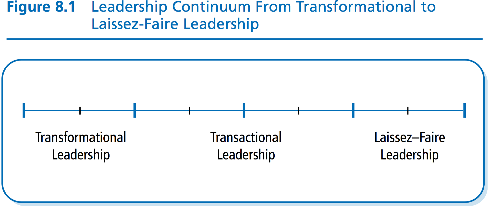
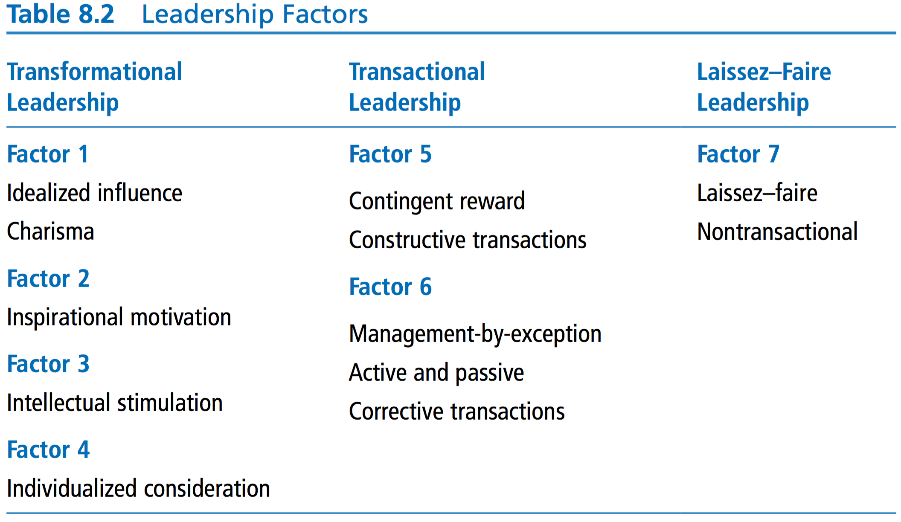
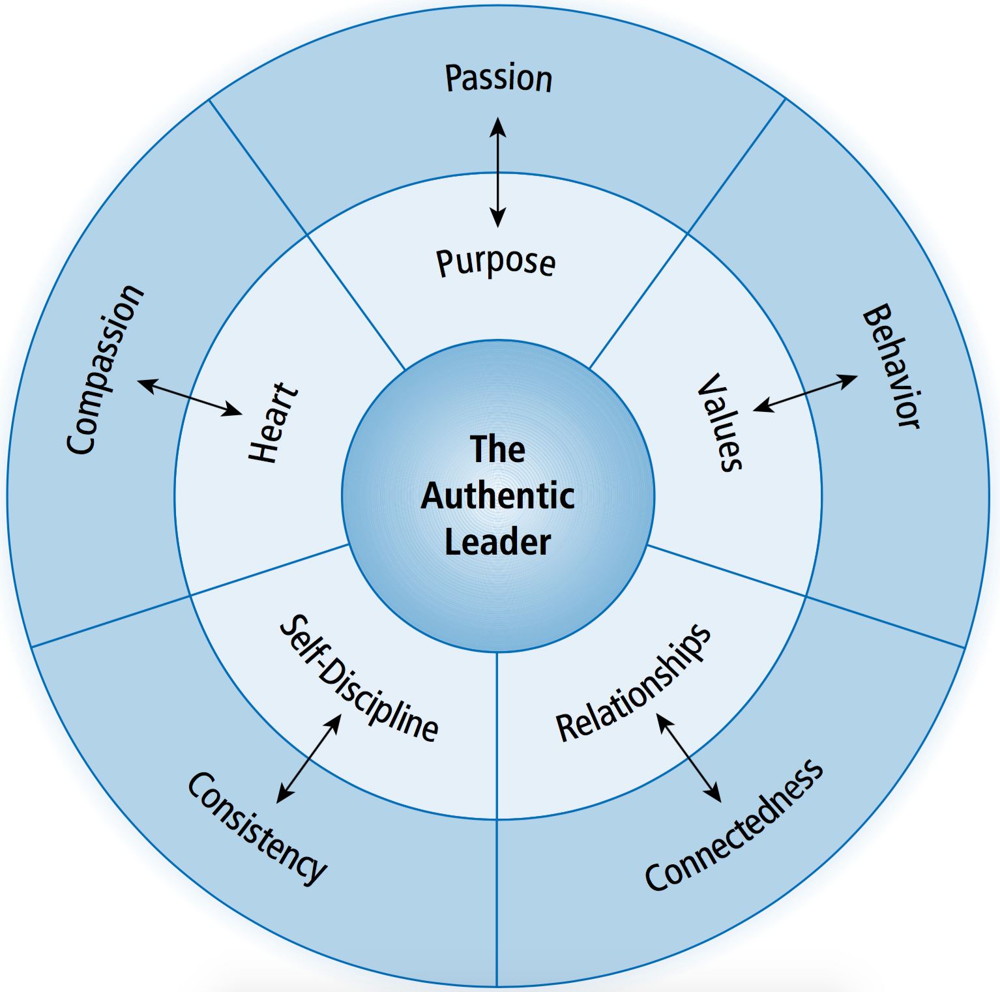
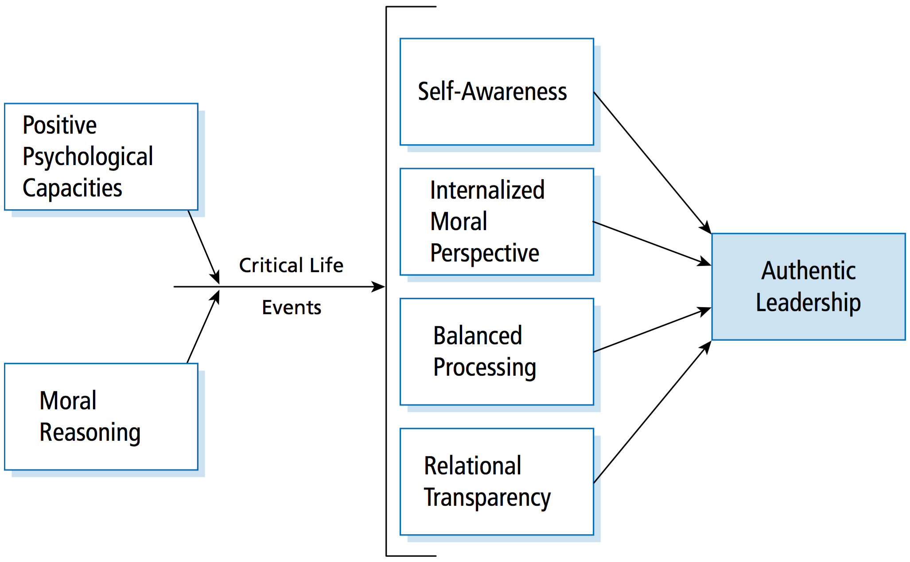

# Session 6

## Learning Objectives

## Chapter 8: Transformational Leadership

> Transformational leadership is part of the “New Leadership” paradigm, which gives more attention to the charismatic and affective elements of leadership

> transformational leadership’s popularity might be due to its emphasis on intrinsic motivation and follower development, which fits the needs of today’s work groups, who want to be inspired and empowered to succeed in times of uncertainty

> Transformational leadership is a process that changes and transforms people. It is concerned with emotions, values, ethics, standards, and long-term goals. It includes assessing followers’ motives, satisfying their needs, and treating them as full human beings. Transformational leadership involves an exceptional form of influence that moves followers to accomplish more than what is usually expected of them. It is a process that often incorporates charismatic and visionary leadership.

### Transformation Leadership vs Transactional Leadership

> Transactional leadership refers to the bulk of leadership models, which focus on the exchanges that occur between leaders and their followers.

> In contrast to transactional leadership, transformational leadership is the process whereby a person engages with others and creates a connection that raises the level of motivation and morality in both the leader and the follower.

> transformational leadership produces greater effects than transactional leadership (Figure 8.3). Whereas transactional leadership results in expected outcomes, transformational leadership results in performance that goes well beyond what is expected.

### Pseudotransformational Leadership

> This term refers to leaders who are self-consumed, exploitive, and power oriented, with warped moral values. Pseudotransformational leadership is considered personalized leadership, which focuses on the leader’s own interests rather than on the interests of others

> The authors hypothesize that authentic transformational leadership positively affects followers’ moral identities and moral emotions (e.g., empathy and guilt) and this, in turn, leads to moral decision making and moral action by the followers. Furthermore, the authors theorize that authentic transforma- tional leadership is positively associated with group ethical climate, decision making, and moral action.

### Transformational Leadership and Charisma

> The word charisma was first used to describe a special gift that certain individuals possess that gives them the capacity to do extraordinary things

> They postulated that charismatic leadership transforms followers’ self-concepts and tries to link the identity of followers to the collective identity of the orga- nization. Charismatic leaders forge this link by emphasizing the intrinsic rewards of work and deemphasizing the extrinsic rewards. The hope is that followers will view work as an expression of themselves. Throughout the process, leaders express high expectations for followers and help them gain a sense of confidence and self-efficacy.

### Transformational Leadership Model

> Bass argued that transformational leadership motivates follow- ers to do more than expected by (a) raising followers’ levels of consciousness about the importance and value of specified and idealized goals, (b) getting followers to transcend their own self-interest for the sake of the team or organization, and (c) moving followers to address higher-level needs. An elaboration of the dynamics of the transformation process is provided in his model of transformational and transactional leadership

#### Transformational Leadership Factors

> Transformational leadership is concerned with improving the performance of followers and developing followers to their fullest potential (Avolio, 1999; Bass & Avolio, 1990a). People who exhibit transformational leadership often have a strong set of internal values and ideals, and they are effective at moti- vating followers to act in ways that support the greater good rather than their own self-interests (Kuhnert, 1994).

##### Idealized Influence (Charisma)

* Emotional component of leadership. Strong role models for followers. High standards of moral and ethical conduct.
* Measured on two components
    * attributional component - attributions of leaders made by followers based on perceptions they have
    * behavioral component - refers to followers observations of leader behavior

> charisma factor describes people who are special and who make others want to follow the vision they put forward

##### Inspirational Motivation

* descriptive of leaders who communciate high expectations to followers, inspiring them through motivation to become committed to and part of the shared vision in the organization

##### Intellectual Stimulation

* leadership that stimulates followers to be creative and innovative and to challenge their own believes and valus as well as those of the leader and the organization
* Strong Opinions, Weakly Held

> This type of leadership supports followers as they try new approaches and develop innovative ways of dealing with organizational issues. It encourages followers to think things out on their own and engage in careful problem solving

##### Individual Consideration

* leaders who provide a supportive climate in which they listen carefully to the individual needs of followers; act as coaches and advisers while trying to assist followers in becoming fully actualized

#### Transactional Leadership Factors

> Transactional leadership differs from transformational leadership in that the transactional leader does not individualize the needs of followers or focus on their personal development.Transactional leaders exchange things of value with followers to advance their own and their followers’ agendas (Kuhnert, 1994). Transactional leaders are influential because it is in the best interest of followers for them to do what the leader wants (Kuhnert & Lewis, 1987).

##### Contingent Reward

* exchange process between leaders and follwoers in which effort by followers is exchanged for specified rewards

##### Management-by-Exception

* leadership that involves corrective criticism, negative feedback, and negative reinforcement
* Takes 2 forms:
    * active - leader watches followers closely for mistakes or rule violations then takes corrective action
    * passive - doing something without telling follower, i.e. bad review

#### Nonleadership Factor

##### Laissez-Faire

* represents an absence of leadership
* hands off, let-things-ride
* leader abdicates responsibility, delays decisions, gives no feedback, and makes little effort to help followers satisfy their needs

### Other Studies

* Nanus identified four common strategies used by leaders in transforming organizations
    1. clear _vision_ of the future state of the organization
        * easier for people to identify with and figure out how they fit in
        * vision needs to grow out of needs of the entire organization
    1. _social architects_ of organizations
        * communicate a direction that transformed their organization's values and norms
    1. created _trust_ by making and standing by their positions
        * trust has to do with being predictable or reliable, even in uncertain situations
    1. used _creative deployment of self_ thru positive self-regard
        * know strengths and weaknesses, emphasize strengths vs dwelling on weaknesses
        * be aware of your own competence

* Kouzes and Posner model consists of five fundamental practices that enable leaders to get extraordinary things accomplished
    1. Model the Way - set a personal example for others by their own behaviors
    1. Inspire a Shared Vision - visualize positive outcomes in the future
    1. Challenge the Process - leaders are experimenting and trying new things
    1. Enable Others to Act - build trust and promote collaboration
    1. Encourage the Heart - reward others for their accomplishments

### How Does the Transformational Approach Work?

> Transformational leaders set out to empower followers and nurture them in change. They attempt to raise the consciousness in individuals and to get them to transcend their own self-interests for the sake of others.

> Throughout the process, transformational leaders are effective at working with people. They build trust and foster collaboration with others. Trans- formational leaders encourage others and celebrate their accomplishments. In the end, transformational leadership results in people feeling better about themselves and their contributions to the greater common good.

Emotional Intelligence

### Strengths

* research
* intuitive
* morally uplifting, disregards Hitler

### Criticisms

* lacks conceptual clarity, covers a wide range of activities and characteristics
* hard to measure
* with great power comes great responsibility, don't use this leadership for bad

## Chapter 9: Authentic Leadership

> It focuses on whether leadership is genuine and “real.” As the title of this approach implies, authentic leadership is about the authenticity of leaders and their leadership.

> People feel apprehensive and insecure about what is going on around them, and as a result, they long for bona fide leadership they can trust and for leaders who are honest and good. People’s demands for trustworthy leadership make the study of authentic leadership timely and worthwhile.

* _intrapersonal perspective_ focuses closely on the leader and what goes on within the leader
    * emphasizes a leader’s life experiences and the meaning he or she attaches to those experiences as being critical to the development of the authentic leader.

* _intrapersonal process_ outlines authentic leadership as relational, created by leaders and followers together
    * authenticity emerges from the interactions between leaders and followers. It is a reciprocal process because leaders affect followers and followers affect leaders.

* _development perspective_ views authentic leadership as something that can be nurtured in a leader, rather than as a fixed trait
    * quthentic leadership develops in people over a lifetime and can be triggered by major life events, such as a severe illness or a new career.
    * authentic leadership is composed of four distinct but related components: self-awareness, internalized moral perspective, balanced processing, and relational transparency

### Approaches to Authentic Leadership

#### Practical Approach

Authentic leaders demonstrate five basic characteristics:
    1. They understand their purpose
    2. they have strong values about the right thing to do
    3. they establish trusting relationships with others
    4. they demonstrate self-discipline and act on their values
    5. they are passionate about their mission

* Terry Fox!

> Last, the George approach identifies compassion and heart as important aspects of authentic leadership. Compassion refers to being sensitive to the plight of others, opening one’s self to others, and being willing to help them. George (2003, p. 40) argued that as leaders develop compassion, they learn to be authentic. Leaders can develop compassion by getting to know others’ life stories, doing community service projects, being involved with other racial or ethnic groups, or traveling to developing countries (George, 2003). These activities increase the leader’s sensitivity to other cultures, back- grounds, and living situations.
>f
> In summary, George’s authentic leadership approach highlights five impor- tant features of authentic leaders. Collectively, these features provide a practi- cal picture of what people need to do to become authentic in their leadership. Authentic leadership is a lifelong developmental process, which is formed and informed by each individual’s life story.

#### Theoretical Approach

> Authentic leadership as “a pattern of leader behavior that draws upon and promotes both positive psychological capacities and a positive ethical climate, to foster greater self-awareness, an internalized moral perspective, balanced processing of information, and relational transparency on the part of leaders working with followers, fostering positive self-development”
> - Walumbwa et al. (2008)

> When leaders tell their life stories, they gain greater self-knowledge, more clarity about who they are, and a better understanding of their role. By understanding their own life experiences, leaders become more authentic.

### How Does Authentic Leadership Work?

The practical approach provides prescriptions for how to be authentic and how to develop authentic leadership.

The theoretical approach describes what authentic leadership is and what accounts for it. From this perspective, authentic leadership works because leaders demonstrate self-awareness, an internalized moral perspective, balanced processing, and relational transparency.

### Strengths

* fulfills need for trustworthy leadership in society
* provides broad guidelines on how to become an authentic leader

### Criticisms

* not a lot of research
