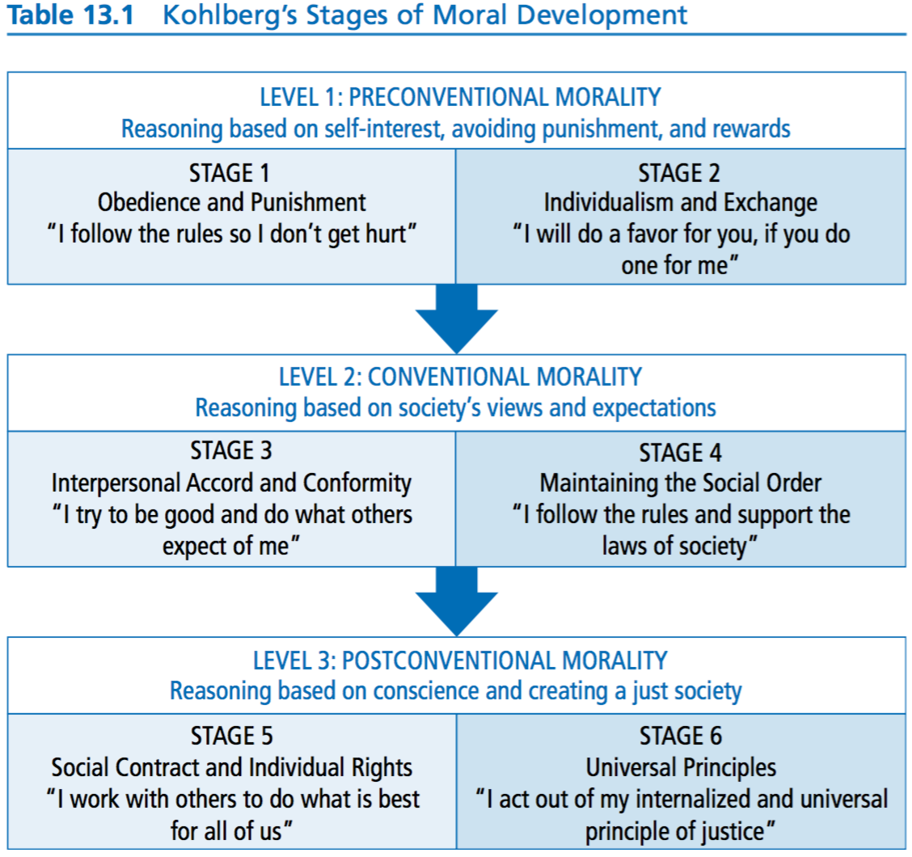
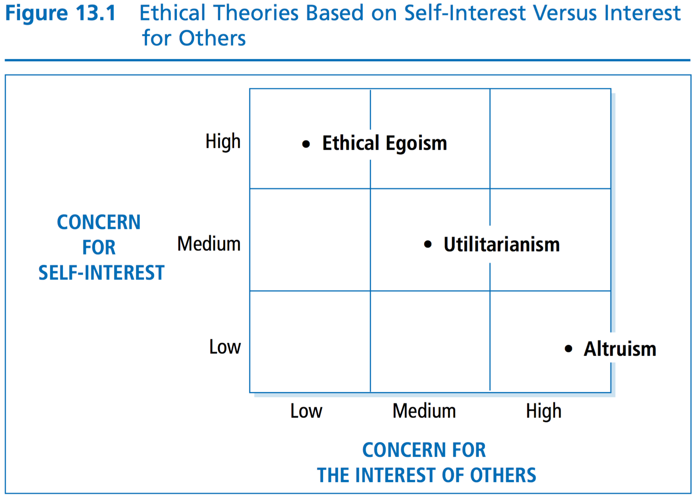
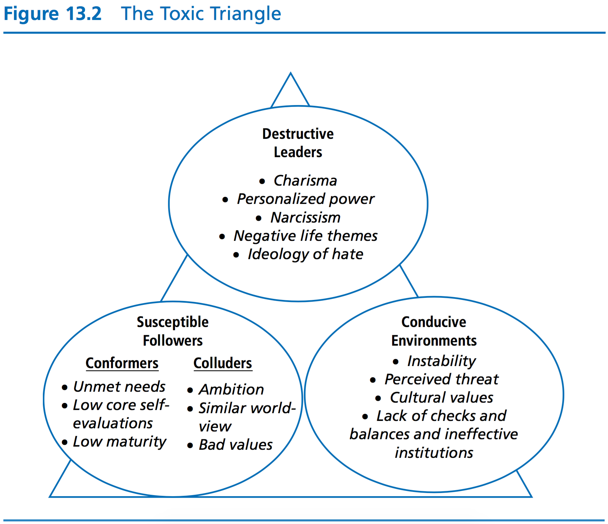
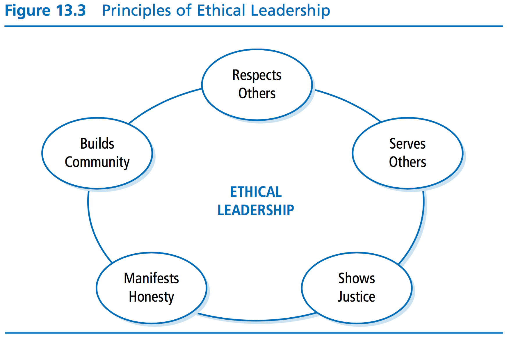

# Session 7

## Learning Objectives

## Chapter 12: Psychodynamic Approach

> Leadership is about the way people behave in orga- nizations, and effective leaders are those who meet the needs of their followers, pay careful attention to group processes, calm anxieties and arouse hopes and aspirations, and know how to liberate human energy and inspire people to positive action. In short, leadership involves har- nessing and leveraging the different and complex forces and dynamics at play in organizational functioning.

> The psychodynamic approach to leadership study and development focuses on the dynamics of human behavior, which are often the most difficult to understand. It acknowledges that people are complex, unique, and paradox- ical beings with rich and myriad motivational drivers and decision-making and interaction patterns.

### The Clinical Paradigm

> By making sense out of leaders’ deeper wishes and fantasies, and showing how these fantasies influence behavior in the organizational world, this paradigm offers a practi- cal way of discovering how leaders and organizations really function

* Four basic premises:
    * there is a rationale behind every human act
    * great deal of mental life—feelings, fears, and motives—lies outside of conscious awareness, but still affects conscious reality and even physical well-being
    * nothing is more central to whom a person is than the way he or she regulates and expresses emotions
    * we are all products of our past experiences

> The Clinical Paradigm unlocks and reveals the subconscious forces under- lying human behavior. It illuminates the human mind—a dark sea filled with strange life-forms, most of them unconscious. And unless we can understand the motives and reasonings for this obscurity, we can hardly hope to foresee or control them

### Key Concepts and Dynamics within the Psychodynamic Approach

#### Focus on the Inner Theatre

> It is the stage filled with people who have influ- enced, for better or worse, our experiences in life. Early experiences with key individuals (such as early caregivers) contribute to the creation of response patterns that have a tendency to repeat themselves in other contexts with different people.

#### Focus on the Leader-Follower Relationships

* at the heart of leadership lies narcissism

> Constructive, or healthy, narcissists have been fortunate enough to have caretakers who provided a supportive environment that led to basic trust and to a sense of control over one’s actions. In leadership roles, constructive narcissists tend to be relatively well balanced and have vitality and a sense of self-esteem, capacity for intro- spection, and empathy. They inspire others not only to be better at what they do, but also to entirely change what they do. Reactive, or excessive, narcissistic leaders, on the other hand, were not as fortunate in childhood. Instead, they were the recipients of over- or understimulation, or inconsistent stimulation. Typically, such leaders are fixated on issues of power, status, prestige, and supe- riority. They are often driven toward achievement and attainment by the need to get even for perceived slights experienced in childhood. Unwilling to tolerate disagreement and criticism, such leaders rarely consult with others. The result is that reactive narcissists operate in their own reality, and without any measures of control or reality testing, this can wreak havoc in the organization.

### How does the Psychodynamic Approach Work?

* defends the idea that psychological, social and emotional processes between leaders and followers have a great influence and need to be taken into consideration
* leaders need to recognize that people differ in their motivational patterns

### Strengths

* another way to look at organizational dynamics
* psychodynamic approach emphasizes the rela- tionship between leader and follower by focusing on the underlying drivers of each and what accounts for the type of relationship between them

### Criticisms

* focuses on dysfunction

## Chapter 13: Leadership Ethics

> Ethics is concerned with the kinds of values and morals an individual or a society finds desirable or appropriate. Furthermore, ethics is concerned with the virtuousness of individuals and their motives. Ethical theory provides a system of rules or principles that guide us in making decisions about what is right or wrong and good or bad in a particular situation. It provides a basis for understanding what it means to be a morally decent human being.

> According to Heifetz, leadership involves the use of authority to help followers deal with the conflicting values that emerge in rapidly changing work environments and social cultures. It is an ethical per- spective because it speaks directly to the values of workers. For Heifetz (1994), leaders must use authority to mobilize people to face tough issues.

> Burns’s (1978) perspective argues that it is impor- tant for leaders to engage themselves with followers and help them in their personal struggles regarding conflicting values. The resulting connection raises the level of morality in both the leader and the follower.

### Principles of Ethical Leadership

#### Respecting Others

> Respect means that a leader listens closely to followers, is empathic, and is tolerant of opposing points of view. It means treating followers in ways that confirm their beliefs, attitudes, and values. When a leader exhibits respect to followers, followers can feel competent about their work. In short, leaders who show respect treat others as worthy human beings.

#### Serve Others

> The idea of leaders serving others was more deeply explored by Robert Greenleaf (1970, 1977), who developed the servant leadership approach.

#### Just

> Ethical leaders are concerned about issues of fairness and justice. They make it a top priority to treat all of their followers in an equal manner. Justice demands that leaders place issues of fairness at the center of their decision making. As a rule, no one should receive special treatment or special consid- eration except when his or her particular situation demands it. When indi- viduals are treated differently, the grounds for different treatment must be clear and reasonable, and must be based on moral values.

#### Honest

> When leaders are not honest, others come to see them as undependable and unreliable. People lose faith in what leaders say and stand for, and their respect for leaders is diminished. As a result, the leader’s impact is compromised because others no longer trust and believe in the leader.

#### Build Community

> An ethical leader takes into account the purposes of everyone involved in the group and is attentive to the interests of the community and the culture. We need to pay attention to how the changes proposed by a leader and followers will affect the larger organization, the community, and society. An ethical leader is concerned with the common good, in the broadest sense.
