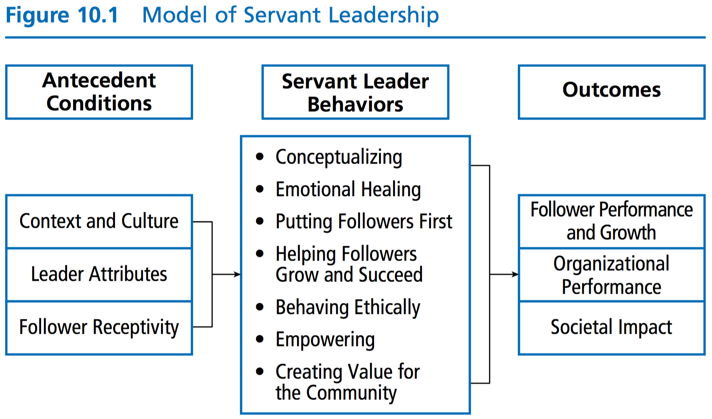
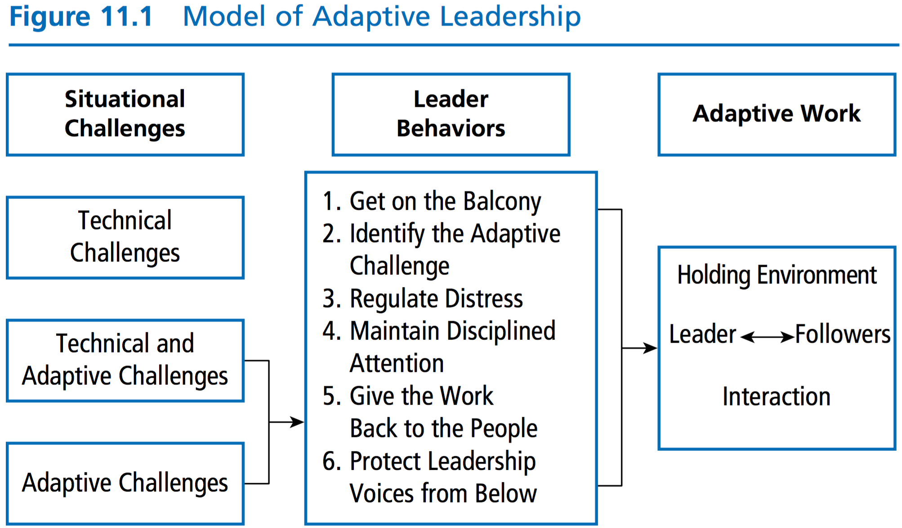
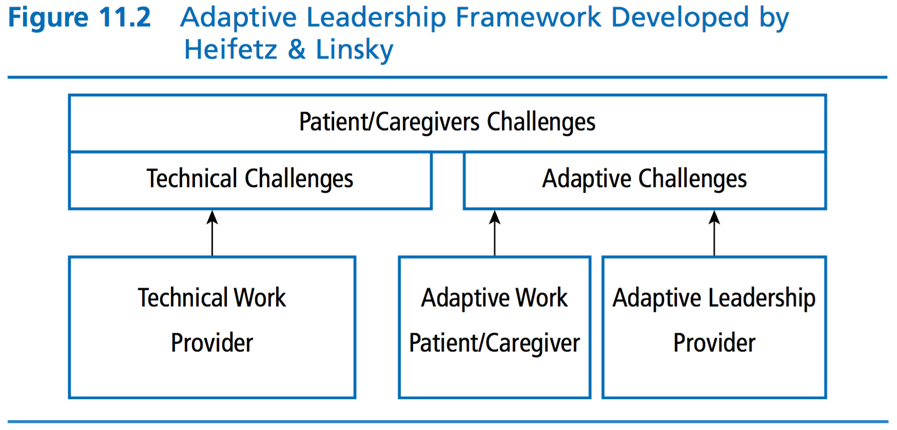

# Session 8

## Chapter 10: Servant Leadership

> Leaders influence, and servants follow. How can leadership be both service and influence?

> Servant leadership emphasizes that leaders be attentive to the concerns of their followers, empathize with them, and nurture them. Servant leaders put followers f irst, empower them, and help them develop their full personal capacities.

### Servant Leadership Defined

> do those served grow as persons; do they, while being served, become healthier, wiser, freer, more autonomous, more likely themselves to become servants

> Robert K. Greenleaf

### Ten Characteristics of a Servant Leader

1. Listening

> Servant leaders communicate by listening first. They recognize that listening is a learned discipline that involves hearing and being receptive to what others have to say. Through listening, servant lead- ers acknowledge the viewpoint of followers and validate these perspectives.

1. Empathy

> Empathy is “standing in the shoes” of another person and attempting to see the world from that person’s point of view. Empathetic servant leaders demonstrate that they truly understand what followers are thinking and feeling.

1. Healing

> Servant leaders care about the personal well-being of their followers. They support followers by help- ing them overcome personal problems.

1. Awareness

> It includes understanding oneself and the impact one has on others. With awareness, servant leaders are able to step aside and view themselves and their own perspectives in the greater context of the situation.

1. Persuasion

> Persuasion is clear and persistent communication that convinces others to change. As opposed to coercion, which utilizes posi- tional authority to force compliance, persuasion creates change through the use of gentle nonjudgmental argument.

1. Conceptualization

> Conceptualization refers to an individual’s abil- ity to be a visionary for an organization, providing a clear sense of its goals and direction. Conceptualization also equips ser- vant leaders to respond to complex organizational problems in creative ways, enabling them to deal with the intricacies of the organization in relationship to its long-term goals.

1. Foresight

> Foresight encompasses a servant leader’s ability to know the future. Leaders should be held accountable for any failures to anticipate what reasonably could be foreseen and to act on that understanding.

1. Stewardship

> Stewardship is about taking responsibility for the lead- ership role entrusted to the leader. Servant leaders accept the responsibility to carefully manage the people and organization they have been given to lead. In addition, they hold the organization in trust for the greater good of society.

1. Commitment to the growth of people

> Servant leaders are committed to helping each person in the organization grow personally and professionally.

1. Building community

> A community is a collection of individuals who have shared interests and pursuits and feel a sense of unity and relatedness. Community allows followers to identify with something greater than themselves that they value. Servant leaders build community to provide a place where people can feel safe and connected with others, but are still allowed to express their own individuality.

### Model of Servant Leadership

> In the model of servant leadership, most of the servant leader behaviors focus directly on recognizing followers’ contributions and helping them realize their human potential. The expected outcome for followers is greater self-actualization. That is, followers will realize their full capabilities when leaders nurture them, help them with their personal goals, and give them control.

> However, when servant leadership was absent, team potency decreased, despite clearer goals. In essence, it frustrates people to know exactly what the goal is, but not get the support needed to accomplish the goal.

## Chapter 11: Adaptive Leadership

> adaptive leadership stresses the _activities of the leader_ in relation to the _work of followers_ in the _contexts_ in which they find themselves

> Adaptive leadership has been used effec- tively to explain how leaders encourage effective change across multiple lev- els, including self, organizational, community, and societal

> An adaptive leader challenges others to face difficult challenges, providing them with the space or opportunity they need to learn new ways of dealing with the inevitable changes in assumptions, perceptions, beliefs, attitudes, and behaviors that they are likely to encounter in addressing real problems.

> adaptive leadership is the practice of mobilizing people to tackle tough challenges and thrive

> Adaptive leaders engage in activities that mobilize, motivate, organize, orient, and focus the attention of others

> The goal of adaptive leadership is to encourage people to change and learn new ways of living so that they may do well and grow. In short, adaptive leader- ship is the behavior of leaders and the actions they take to encourage others to address and resolve changes that are central in their lives.

### Leadership Behaviors

1. Get on the Balcony

> metaphor for stepping out of the fray and finding perspective in the midst of a challenging situation

1. Identify Adaptive Challenges

> The adaptive leadership process suggests that leaders are most effective using adaptive leadership behaviors for adap- tive challenges and technical leadership for technical challenges. Treating challenges with the wrong kind of leadership is maladaptive.

1. Regulate Distress

> three ways that leaders can main- tain productive levels of stress: (1) create a holding environment; (2) provide direction, protection, orientation, conflict management, and productive norms; and (3) regulate personal distress.

> holding environment is the place where all parties gather to begin talking to each other, define issues, and clarify competing interests and needs

1. Maintain Disciplined Attention

> This means that the leader needs to encourage people to focus on the tough work they need to do.

1. Give the Work Back to the People

> Leaders need to be aware of and monitor the impact they have on others. Giving work back to the people requires a leader to be attentive to when he or she should drop back and let the people do the work that they need to do. This can be a fine line; leaders have to provide direction, but they also have to say, “This is your work—how do you think you want to handle it?” For adaptive leaders, giving work back to the people means empowering people to decide what to do in circumstances where they feel uncertain, expressing belief in their ability to solve their own problems, and encouraging them to think for themselves rather than thinking for them.

1. Protect Leadership Voices from Below

> This means that adaptive leaders have to be cautious to listen and be open to the ideas of people who may be at the fringe, marginalized, or even deviant in the group or organization. This is a challenge because when the leader gives voice to an out-group member, it is upsetting to the social equilibrium of the group.

### How does Adaptive Leadership Work

> Adaptive leadership centers on the adaptations required of people in response to changing environments and how leaders can support them during these changes.

> First, the leader takes time to step back from a challenging situation to understand the com- plexities of the situation and obtain a fuller picture of the interpersonal dynamics occurring among the participants. Second, in any situation or context where people are experiencing change, the leader first makes an assessment to determine if the change creates challenges that are technical or adaptive in nature. If the challenges are technical, the leader addresses the problems with his or her authority and expertise or through the rules and procedures of the organization. If the challenges are adaptive, the leader engages in several specific leader behaviors to move the adaptive process forward.

